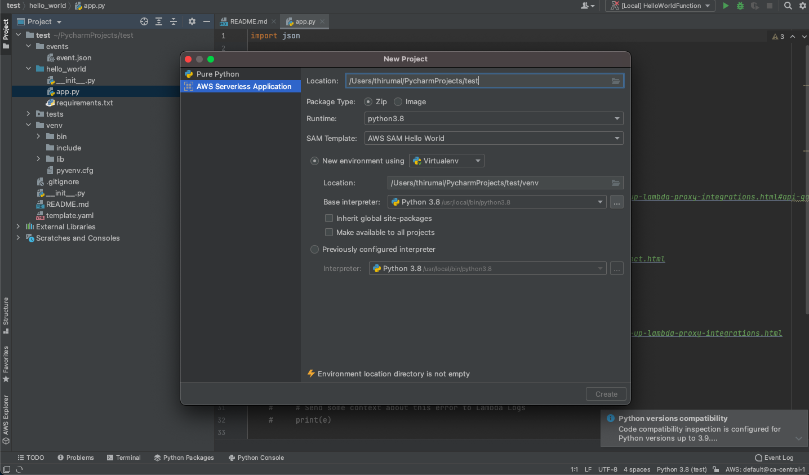
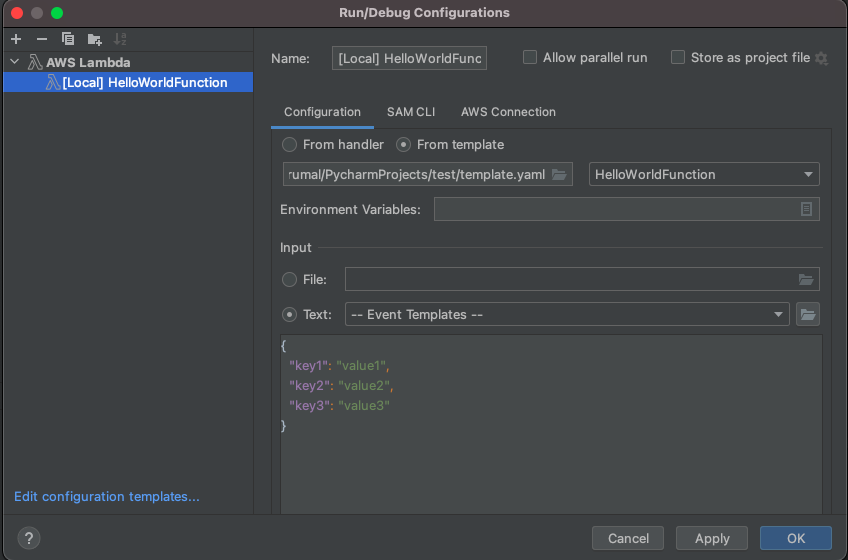
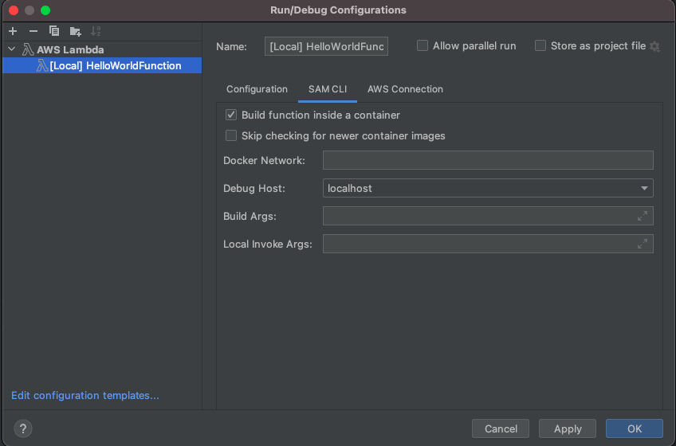

#### Set up lambda function in pycharm using AWS SAM(Serverless Application Model)

1. Install PyCharm with AWS toolkit & SAM plugin, AWS CLI & configure IAM user.

2. New Project -> AWS Serverless Application -> Give project name in the location and choose the runtime and hit the create button

3. Wait for some time to set up all config.

#### Run Locally

1. Install and start `DOCKER`

2. Go to pycharm -> `Run` -> `Edit configurations` -> select input text `hello world` template in the configuration.

	

	

3. Check the `Build function inside a container` in `SAMCLI`.

4. Click on `Run Locally`

### Deploy

1. Right click on project and click on `Deploy Serverless Application`.

2. It requires permission on
	* AWS Cloud formation
	* S3
	* lambda
	* API Gateway
	* IAM

#### Tutorial

[https://www.jetbrains.com/pycharm/guide/tutorials/intro-aws/cleanup/](https://www.jetbrains.com/pycharm/guide/tutorials/intro-aws/cleanup/)

### Troubleshoot Know Problem

1. Docker permission

	Preferences -> Resources -> File Sharing -> Add "/Application"
